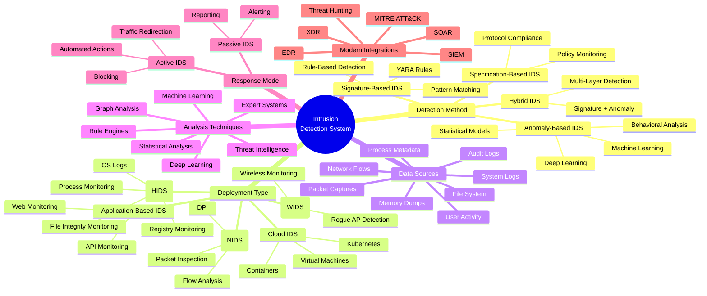
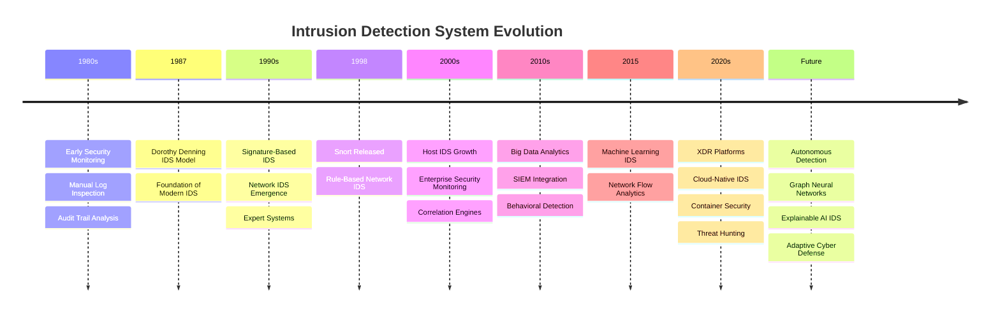

# **`Awesome`** Intrusion Detection System (_[IDS](https://wikipedia.org/wiki/Intrusion_detection_system)_) 

 

    
    &nbsp;
    
    &nbsp;
    
    

An intrusion detection system is a device or software application that monitors a network or systems for malicious activity or policy violations.

## 📖 Contents
- [My Other Awesome Lists](#my-other-awesome-lists)
- [Contributing](#contributing)
- [Contributors](#contributors)

## Classification of IDS

### Network intrusion detection systems (NIDS)

### Host-based intrusion detection systems (HIDS)

## Detection Method

### Signature-based

### Anomaly-based

## Intrusion Prevention

### Classification

### Detection Methods

## Tools
* [Suricata](https://wikipedia.org/wiki/Suricata_(software)) - [Suricata](https://github.com/OISF/suricata) is an open-source network analysis and threat detection software. 
* [Snort](https://wikipedia.org/wiki/Snort_(software)) - [Snort](https://github.com/snort3/snort3) is a free open source network intrusion detection system and intrusion prevention system.

##

### My Other Awesome Lists
You can access the my other awesome lists [here](https://cyberthreatdefence.com/my_awesome_lists)

### Contributing
[Contributions of any kind welcome, just follow the guidelines](contributing.md)!

### Contributors
[Thanks goes to these contributors](https://github.com/cybersecurity-dev/awesome-intrusion-detection-system/graphs/contributors)!

### License

[🔼 Back to top](#awesome-intrusion-detection-system-ids-)
